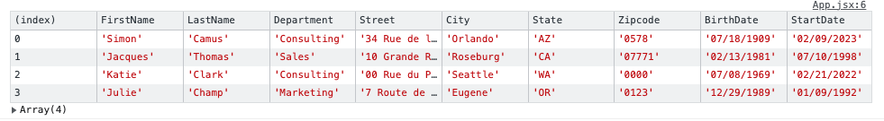

# A React Component Library Table

This is a table you can easily include in your React Project with your own data. It can sort, filter and search through it. It has pagination included so you can select the number of rows to display in the table and navigate to the next or previous page.

It also has the functionality to select one or several rows and return the selection has an array. You can unable or disable that functionality.

You can choose to hide the indexing on the table.

It is published on npm and will work with default props if none are provided.
It was created using Vite, tested with react-testing-library and styled with css.


## Install

```bash
npm i table-react-component-library
```

## Default Usage

```bash
import TableData from 'table-react-component-library';

export default function YourComponent(){

    function getSelection(selectedRows){
        console.table(selectedRows)
    }
    return(<TableData getSelection={getSelection}/>)
}
```



## Custom Usage

```bash

const data = [
{
  FirstName: 'Skippy Jon',
  LastName: 'Jones',
  BirthDate: '10/14/1988',
  StartDate: '08/21/2009',
  Street: 'Avenue Somewhere',
  City: 'Skinner',
  State: 'OH',
  Zipcode: '24624523',
  Department: 'Engineering',
},
{
    FirstName: 'Jessica',
    LastName: 'MiddleBridge',
    BirthDate: '01/11/1978',
    StartDate: '03/17/2000',
    Street: 'Salmon Lane',
    City: 'Burley',
    State: 'KS',
    Zipcode: '2452345',
    Department: 'Sales',
}
];

export const mockedColumns = [
  {
    field: 'FirstName',
    header: 'Firstname',
    type: 'string',
    sortable: true,
    width: '80',
  },
  {
    field: 'LastName',
    header: 'Lastname',
    type: 'string',
    sortable: true,
    width: '90',
  },
  {
    field: 'BirthDate',
    header: 'Birthdate',
    type: 'date',
    sortable: true,
    width: '90',
  },
  {
    field: 'StartDate',
    header: 'Start Date',
    type: 'date',
    sortable: true,
    width: '90',
  },
  {
    field: 'Street',
    header: 'Street',
    type: 'string',
    sortable: true,
    width: '200',
  },
  {
    field: 'City',
    header: 'City',
    type: 'string',
    sortable: true,
    width: '100',
  },
  {
    field: 'State',
    header: 'State',
    type: 'string',
    sortable: false,
    width: '40',
  },
  {
    field: 'Zipcode',
    header: 'Zipcode',
    type: 'string',
    sortable: true,
    width: '70',
  },
  {
    field: 'Department',
    header: 'Department',
    type: 'string',
    sortable: true,
    width: '100',
  },
]


const title="Your title" or ""

const theme="dark" or "light"

function customSortList(data){
    //sort your data
    return data
}

const getSelection = (selectedTableData) => {
    console.log(selectedTableData)
}

const unableSelection = true or false;

const unableMultipleSelection = true or false;

const showIndex = true or false;

return(
    <DataTable
      data={data}
      columns={columns}
      title={title}
      theme={theme}
      sortListFunc={sortListFunc}
      getSelection={getSelection}
      unableSelection={unableSelection}
      unableMultipleSelection={unableMultipleSelection}
      showIndex={showIndex}
      />)


```

**Parameters**:

- **_data_**: The data to display

  1. Type: an Array of Objects
  2. Required: false
  3. Specs: Object keys need to match column objects field values.

- **_columns_**: The table headers to display

  1. Type: an Array of Objects
  2. Required: false

- **_title_**: The title in h1 to display

  1. Type: String
  2. Required: false
  3. Specs: An empty string will remove the title element completely from the component.

- **_theme_**: The theme to choose from

  1. Type: String
  2. Required: false
  3. "light"(default) OR "dark"

- **_sortListFunc_**

  1. Type: Function
  2. Required: false
  3. Specs: The default function sorts strings, numbers and dates (in MM, DD, YYYY format) in ascending and descending order.

- **_getSelection_**

  1. Type: Function
  2. Required: true
  3. Specs: The function gets returned the selected row or rows so you can add the needed functionality for your app regarding them (like deleting them).

- **_unableSelection_**

  1. Type: Boolean
  2. Required: false
  3. Specs: False will make the clicking of the rows do nothing and an empty array will be returned to getSelection

- **_unableMultipleSelection_**

  1. Type: Boolean
  2. Required: false
  3. Specs: False will make only one row selected at a time

- **_showIndex_**
  1. Type: Boolean
  2. Required: false
  3. Specs: False will hide the indexing of the data rows

## To run this project locally

To run in development =>

```bash
npm run dev
```

To run tests =>

```bash
npm test
```

or

```bash
npm run watch
```
