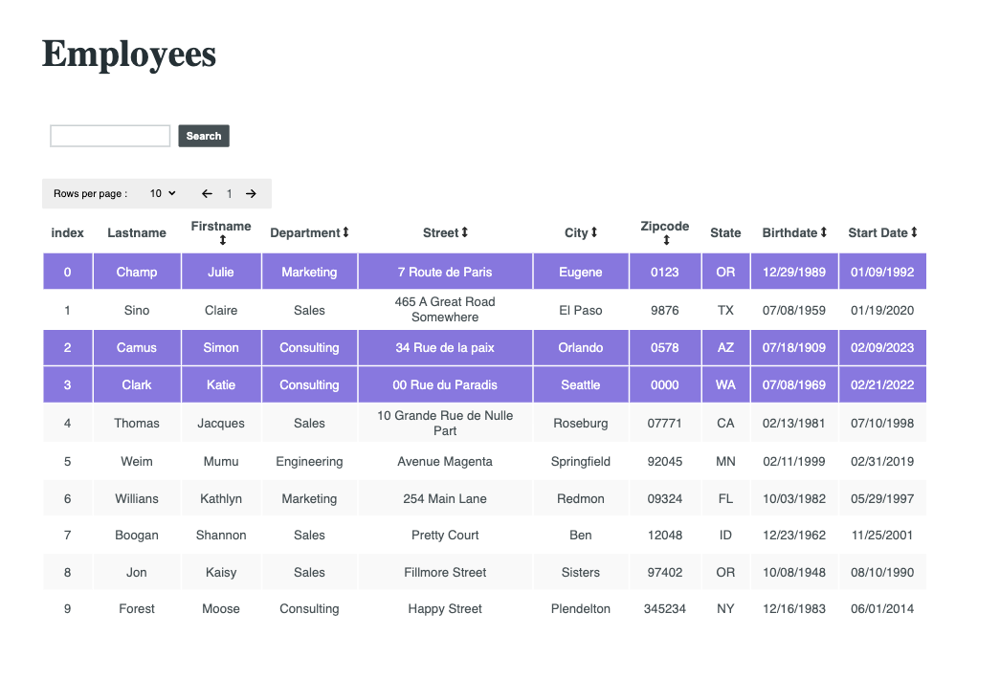

# A React Component Library Table

This is a react component table that can sort, filter and search data. It also has pagination so you can select the number of rows to display in the table and navigate to the next or previous page. It is publish on npm and will work with default props if none are provided.
It was created using Vite, tested with react-testing-library and styled with css.



## Install

```bash
npm i @mariemoore/table-react-component
```

## Default Usage

```bash
import TableData from '@mariemoore/table-react-component';

export default function YourComponent(){
    return(<TableData />)
}
```

## Custom Usage

```bash

const data = [  {
  FirstName: 'Skippy Jon',
  LastName: 'Jones',
  BirthDate: '10/14/1988',
  StartDate: '08/21/2009',
  Street: 'Avenue Somewhere',
  City: 'Skinner',
  State: 'OH',
  Zipcode: '24624523',
  Department: 'Engineering',
}]

const columns = [
    'FirstName',
    'LastName',
    'BirthDate',
    'StartDate',
    'Street',
    'City',
    'State',
    'Zipcode',
    'Department',
]

const title="Your title"

const theme="dark"

function customSortList(data){
    //sort your data
    return data
}

return(
    <DataTable
        data={data}
        column={columns}
        theme={theme}
        title={title}
        sortListFunc={customSortList} />)
```

**Parameters**:

- **_data_**: The data to display

  1. Type: an Array of Objects
  2. Required: false
  3. Specs: Object keys need to match column values. Data whose values are dates have to include "date" in the key. Example: "startDate, birthdate"

- **_columns_**: The table headers to display

  1. Type: an Array of String
  2. Required: false
  3. Specs: The values need to match the object keys

- **_title_**: The title in h1 to display

  1. Type: String
  2. Required: false

- **_theme_**: The theme to choose from

  1. Type: String
  2. Required: false
  3. "light"(default) OR "dark"

- **_sortListFunc_**

  1. Type: Function
  2. Required: false
  3. Specs: The default function sorts strings, numbers and dates (in MM, DD, YYYY format) in ascending and descending order.

## To run this project locally

To run in development =>

```bash
npm run dev
```

To run tests =>

```bash
npm test
```

or

```bash
npm run watch
```
